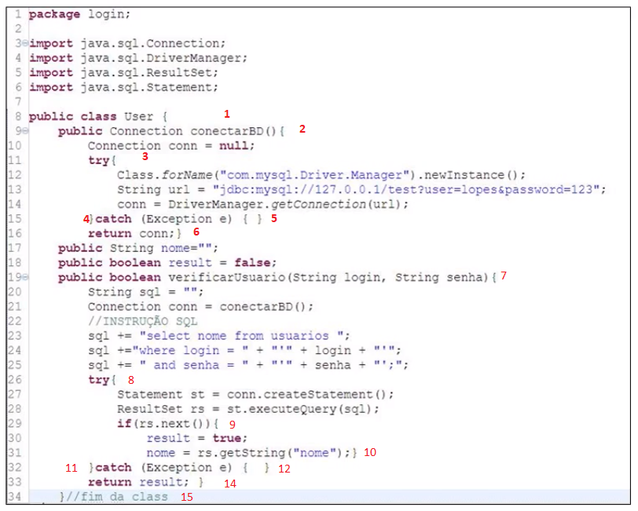
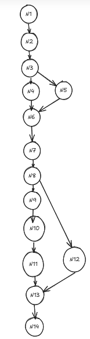

# Etapa 3

## Código com Numeração

## Grafo de Fluxo

## Cálculo da Complexidade
Nós = 14
Arestas = 15

M = E - N + 2P

M = 15 - 14 + (2.1)

M = 1 + 2

M = 3

## Caminhos

Caminho 1 = N1-N2-N3-N4-N6-N7-N8-N9-N10-N11-N13-N14

Caminho 2 = N1-N2-N3-N4-N6-N7-N8-N12-N13-N14

Caminho 3 = N1-N2-N3-N5-N6-N7-N8-N12-N13-N14